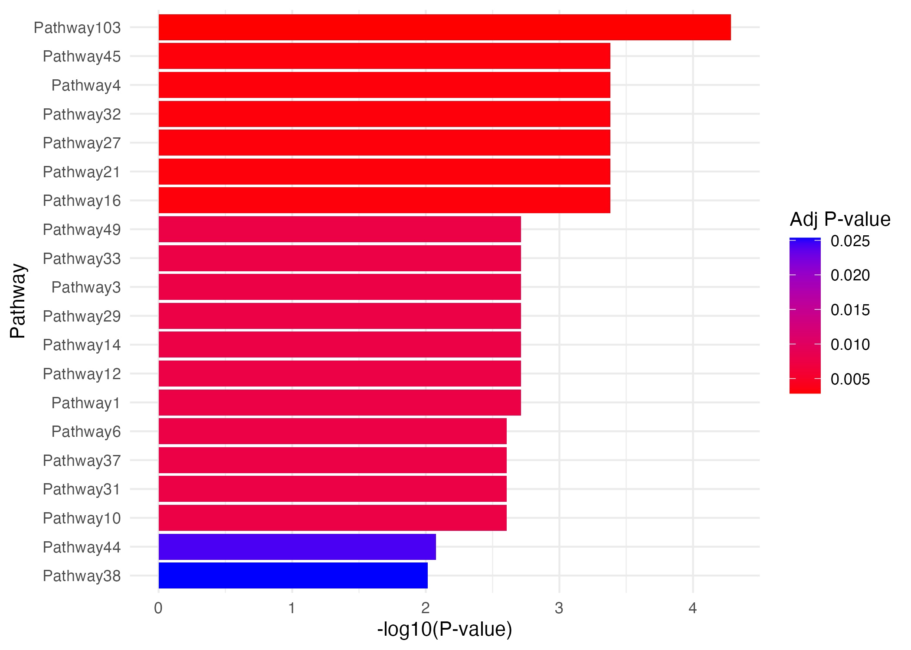
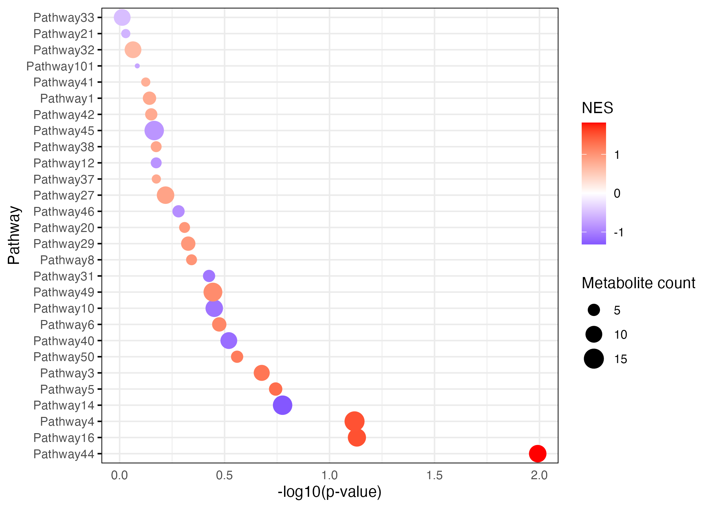
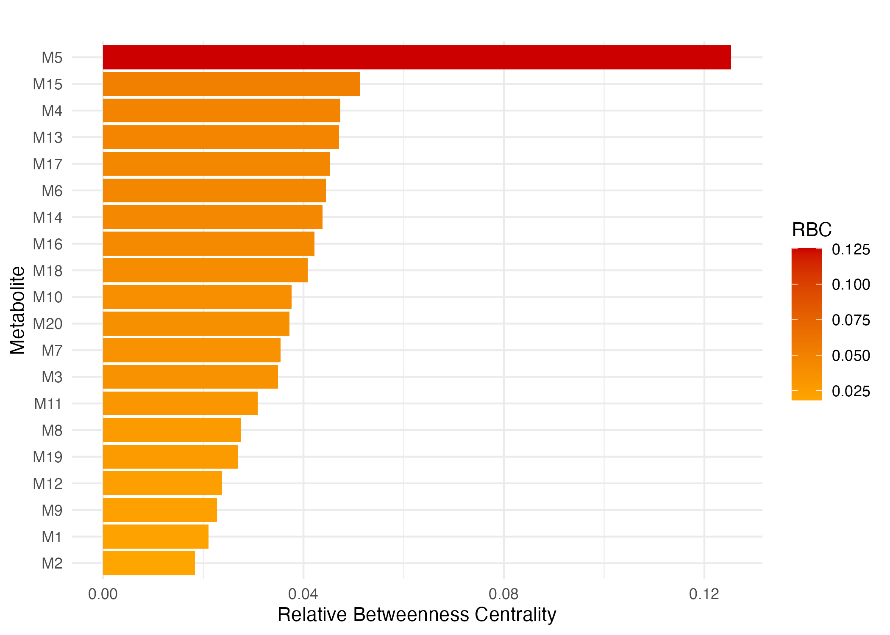

<!-- README.md is generated from README.Rmd. Please edit that file -->

# enrichmet

<!-- badges: start -->
<!-- badges: end -->

enrichmet performs pathway enrichment analysis using Fisher’s exact
test, computes betweenness centrality for metabolites, and performs
Metabolite Set Enrichment Analysis (MetSEA). It also generates plots for
pathway enrichment, MetSEA, and relative betweenness centrality (RBC).

## Installation

You can install the development version of enrichmet like so:

``` r
# FILL THIS IN! HOW CAN PEOPLE INSTALL YOUR DEV PACKAGE?
```

## Example

``` r

This is a basic example 


``` r
library(ggplot2)
library(fgsea)
library(dplyr)
#> 
#> Attaching package: 'dplyr'
#> The following objects are masked from 'package:stats':
#> 
#>     filter, lag
#> The following objects are masked from 'package:base':
#> 
#>     intersect, setdiff, setequal, union
library(tidyr)
library(openxlsx)
library(readxl)
library(stringr)
library(igraph)
#> 
#> Attaching package: 'igraph'
#> The following object is masked from 'package:tidyr':
#> 
#>     crossing
#> The following objects are masked from 'package:dplyr':
#> 
#>     as_data_frame, groups, union
#> The following objects are masked from 'package:stats':
#> 
#>     decompose, spectrum
#> The following object is masked from 'package:base':
#> 
#>     union
library(enrichmet)
## basic example code
## ** Examples

# Generate example data with at least n=50 metabolites
set.seed(1234)

# Create 50 unique metabolites
inputMetabolites <- paste0("M", 1:20)

# Generate 10 pathways with random metabolites assigned
pathway_names <- paste0("Pathway", 1:50)
PathwayVsMetabolites <- data.frame(
  Pathway = rep(pathway_names, each = 1),
  Metabolites = sapply(1:50, function(x) paste(sample(inputMetabolites, sample(5:15, 1)), collapse = ","))
)

# Add new pathway entries (Pathway101 and Pathway102)
new_rows <- data.frame(
  Pathway = c("Pathway101", "Pathway102", "Pathway103", "Pathway104", "pathway105"),
  Metabolites = c(
    "M12,M13,M14,M15,M16,M1,M18,M3,M29,M6,M16,M4",
    "M6,M7,M8,M9,M10,M11,M9,M29,M6,M6,M16,M4",
    "M24,M25,M26,M27,M28,M29,M30,M29,M26,M5",
    "M13,M14,M15,M16,M17,M24,M27,M14",
    "M15,M16,M17,M18,M19,M20,M21,M4,M8,M10"
    
  )
)

# Combine with existing PathwayVsMetabolites
PathwayVsMetabolites <- rbind(PathwayVsMetabolites, new_rows)

# Generate example metabolite-level data
example_data <- data.frame(
  met_id = inputMetabolites,
  pval = runif(20, 0.001, 0.05),  # Random p-values between 0.001 and 0.05
  log2fc = rnorm(20, mean = 0, sd = 1)  # Log2 fold changes from normal distribution
)


# Run the enrichment analysis
enrichmet(inputMetabolites, PathwayVsMetabolites, example_data, top_n = 20)
#>   |                                                                              |                                                                      |   0%  |                                                                              |======================================================================| 100%
#> $pathway_plot
```



    #> 
    #> $gsea_plot



    #> 
    #> $rbc_plot


# enrichmet
# enrichmet_package
